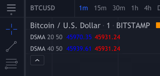
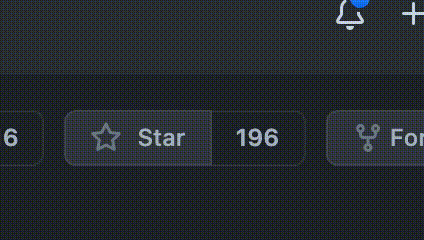

⚠️ *WARNING: Running command line software on your computer is risky! Although this software has no known malicious code in it - it does rely on __3rd-party libraries which can be vulnerable to hacking__. As of late 2021, 3rd-party hacks have been on the rise - use at your own risk.*

👋 *NOTE: We have a service that automates this tool on secured, virtual servers. Become a beta tester at [alertzmanager.io](https://alertzmanager.io/?utm_source=github&utm_medium=link&utm_campaign=github_link&utm_content=README_top)*

# Add TradingView Alerts Tool

**Automatically add custom alerts to TradingView in bulk**

[](https://www.npmjs.com/package/@alleyway/add-tradingview-alerts-tool)


[](https://gitlab.com/mlake900/add-tradingview-alerts-tool/-/pipelines)

[](https://gitlab.com/mlake900/add-tradingview-alerts-tool/-/pipelines)


## Why This Project Exists
Trading platforms (such as [3Commas](https://3commas.io/) and [Alertatron](https://alertatron.com/)) allow automated trades based on **custom TradingView alerts** which can be pinged using webhook URLs to execute trades. 

When using a **TradingView indicator** (such as [Material Indicators](https://materialindicators.com/)), you can send signals to your trading bot using **TradingView alerts** 

So what if you want to use an indicator to trade across dozens or hundreds of pairs? Because there is no TradingView API to add alerts in bulk, you'd need to maintain those alerts by hand. 

## How does this tool work?

Using open source software designed for automated website testing, we can enter as many custom alerts as your TradingView account allows. It installs its very own Chrome browser (called Chromium) which is controlled by this script.

Watch as this tool enters your TradingView alerts automatically.


## Requirements

MacOS/Windows/Linux

[Install NodeJS](https://nodejs.org/en/) (minimum version: 14.15.0)

## Installation

Open Terminal/PowerShell and run the following:

    # make sure you're running at least node version 14.15.0
    node -v 

    # create your tradingview-alerts-home directory and/or upgrade version
    npx @alleyway/create-tradingview-alerts-home
    
    # Follow prompts to initialize your tradingview-alerts-home
    
Edit your config.yml file (if you're passing signals for automated trading such as 3commas, configure those details here) 

```yaml
files:
  input: binance_usdt_pairs.csv
  exclude: blacklist.csv
tradingview:
  # The chart which has the indicator you'd like to use
  chartUrl: https://www.tradingview.com/chart/WS5uK1l5/
  # (optional) set the chart interval before adding pairs, otherwise interval of last saved chart is used
  # examples: 1s | 30s | 1m | 15m | 1h | 1D | 1M
  interval: 4h
  # Optionally supply login details or login manually once and restart script
  #username: 
  #password: 
alert:
  condition:
    primaryLeft: MTF Deviation
    primaryRight:
    secondary: Tier1 long
    tertiaryLeft:
    tertiaryRight:
    quaternaryLeft: 
    quaternaryRight:
  option: Once Per Bar Close
  actions:
    notifyOnApp: false
    showPopup: false
    sendEmail: false
    webhook:
      enabled: true
      url: "https://3commas.io/trade_signal/trading_view"
  # alert name is optional - can override in csv if desired and use {{symbol|base|quote}}
  # name: MI dev3 for {{base}} {{quote}}
  # indentation matters! {{quote}} and {{base}} are swapped out for quote asset(eg. USDT) and the base (eg. BTC)
  message: >
    {
        "message_type": "bot",
        "bot_id": 999999,
        "email_token": "fffffff-fffff-fffff-ffff-ffffffffff",
        "delay_seconds": 0,
        "pair": "{{quote}}_{{base}}"
    }
```


## Fetching Trading Pairs

Creates CSV file for use as input (see above config) for supported exchanges. Want other exchanges? [File an issue!](https://github.com/alleyway/add-tradingview-alerts-tool/issues/new)) 

#### Download Trading Pairs From Binance/BinanceUS

This command downloads all USDT trading pairs for Binance: 
```yaml 
    ./atat fetch-pairs binance usdt
    
    # Creates binance_usdt_pairs.csv    
```

This command downloads all trading pairs for BinanceUS:
```yaml
    ./atat fetch-pairs binanceus all

    # Creates binanceus_all_pairs.csv
```

#### Download Trading Pairs From FTX

In addition to fetching all/btc/usd/usdt/etc, you may also fetch perpetual contracts by specifying "perp" 

```yaml
    ./atat fetch-pairs ftx perp

    # Creates ftx_perp_pairs.csv
```


#### Download Trading Pairs From Coinbase

```yaml
    ./atat fetch-pairs coinbase usd

    # Creates coinbase_usd_pairs.csv
```


#### Download Trading Pairs From Bittrex

```yaml
    ./atat fetch-pairs bittrex btc

    # Creates bittrex_btc_pairs.csv
```

#### Download Trading Pairs From Kraken

```yaml
    ./atat fetch-pairs kraken usd

    # Creates kraken_usd_pairs.csv
```

#### Download Trading Pairs From KuCoin

```yaml
    ./atat fetch-pairs kucoin usdt

    # Creates kucoin_usd_pairs.csv
```

#### Download Trading Pairs From OKEx

```yaml
    ./atat fetch-pairs okex usdt

    # Creates okex_usd_pairs.csv
```

#### Download Trading Pairs From ByBit

```yaml
    ./atat fetch-pairs bybit all

    # Creates bybit_all_pairs.csv
```


...and so on..


## Adding TradingView Alerts 

### Before you run the script

When adding alerts TradingView uses your last settings as defaults for new alerts.
If not explicitly set in the config.yml file, it will use the settings from the last alert made. So if you prefer to play a sound or not, create an alert with that setting before running the script. 

You must actually create an alert once with those options, before they become defaults. (You can immediately delete the alert)

### Running the script 

NOTE: You'll need to log into TradingView the first time you run the script, then you'll need to close the browser and re-run the command 

    ./atat add-alerts

You can stop the script in Terminal/PowerShell by pressing Ctrl-C
    
If the tool gets interrupted for some reason, you can remove the rows of already-added alert symbols (from the .csv) and re-run


## Troubleshooting

* Moving too fast for your connection speed? Try adjusting the delay option (default is 1000) 


    ./atat --delay 1500 add-alerts 

* Selecting the wrong option? Conditions can be regular expressions. For example...

Let's say you have a conditions dropdown with multiple indicator configurations like so:

    MTF Deviation - Mtrl_Scientist v0.7 (50, 530, 750, 3)
    MTF Deviation - Mtrl_Scientist v0.7 (50, 530, 750, 6)
    MTF Deviation - Mtrl_Scientist v0.7 (50, 530, 750, 9)

If your configuration only used the term "MTF Deviation" the tool might incorrectly select the first option containing that term.

For example, the following regular expression will match the indicator with percent deviation setting of **6** :

```yaml
alert:
  condition:
    primaryLeft: /^MTF Deviation.*,\s6\)$/
```

Another common issue is sometimes option text for one condition can exist entirely within another.

For example:

    Blue Wave Crossing Down [Sm. Red Dot]
    Blue Wave Crossing UP [Sm. Green Dot]
    Green Dot

A regular expression to match "Green Dot" exactly would be the following:

```yaml
alert:
  condition:
    primaryLeft: /^Green Dot$/
```

❓[Learn more about regular expression syntax](https://www.w3schools.com/jsref/jsref_obj_regexp.asp)


* "atat" command not found? From your tradingview-alerts-home directory run the following:


    npx @alleyway/create-tradingview-alerts-home

* Any other hiccups? [File an issue](https://github.com/alleyway/add-tradingview-alerts-tool/issues/new)

## Advanced Usage

### Multiple Configurations

A configured TradingView Indicator that works for assets quoted in BTC may not be appropriate for USD pairs, therefore, you'll want to segment your setup as follows:

| Abstract                                                                                                        | Concretely                                                                                                                                                                                |
|-----------------------------------------------------------------------------------------------------------------|-------------------------------------------------------------------------------------------------------------------------------------------------------------------------------------------|
| List of pairs quoted only in BTC                                                                                | Run "./atat fetch-pairs binance btc"<br>input: binance_usdt_pairs.csv                                                                                                                          |
| TradingView chart layout with an indicator tailored specific to BTC (eg. set 6% for deviation on MTF deviation) | chartUrl: https://www.tradingview.com/chart/WS5uK1l5/                                                                                                                                     |
| 3commas trading bot to handle only BTC                                                                          | {<br>    "message_type": "bot",<br>    "bot_id": 999999,<br>    "email_token": "fffffff-fffff-fffff-ffff-ffffffffff",<br>    "delay_seconds": 0,<br>    "pair": "{{quote}}_{{base}}"<br>} |
| A dedicated configuration file for the above                                                                    | ./atat add-alerts config.btc.yml                                                                                                                                                         |

NOTE: running "./atat add-alerts" will default to config.yml unless you specify one (eg. "./atat add-alerts config.btc.yml")


### Token Replacement in Alert Settings

There are some scenarios where you may want some pairs to use different indicators or the same indicator with different settings (must be added to the chart for each setting - this script CANNOT adjust indicator settings yet)  




Then you could add an arbitrary column to your .csv - here we use "DSMAsetting"

```
symbol,quote,base,DSMAsetting
BINANCE:1INCHUSDT,USDT,1INCH,40
BINANCE:AAVEUSDT,USDT,AAVE,20
BINANCE:ACMUSDT,USDT,ACM,40
BINANCE:ADAUSDT,USDT,ADA,20
```

You can then use any value from your csv by surrounding the column header name with double braces as follows:

```yaml
...
alert:
  condition:
    primaryLeft: "DSMA ({{DSMAsetting}}, 50)"
...
```


### Send a single alert to multiple 3commas bots

3commas will allow you to use an array of commands in the message, I typically send a message to two bots: one for paper trading, and another "real" account which I can choose to disable.

So you can use a JSON array for the message:

```yaml
  message: >
    [{
        "message_type": "bot",
        "bot_id": 999999,
        "email_token": "fffffff-fffff-fffff-ffff-ffffffffff",
        "delay_seconds": 0,
        "pair": "{{quote}}_{{base}}"
    },
    {
        "message_type": "bot",
        "bot_id": 999999,
        "email_token": "fffffff-fffff-fffff-ffff-ffffffffff",
        "delay_seconds": 0,
        "pair": "{{quote}}_{{base}}"
    }]
```

### Send an alert to Alertatron

This works in the same way as for 3Commas, but Alertatron using a different format for its messages. For example...

```yaml
  message: >
    binanceKeys({{quote}}_{{base}}) {
        market(side=buy, amount=50%);
        stopOrder(side=sell, amount=100%p, offset=2%);
        limit(side=sell, amount=100%p, offset=3%);
    }
```

## Do You Find This Tool Helpful? 

Consider one of the following:

1) Increase awareness on GitHub: Click the ⭐ at the top of the page!



2) Become a _FREE_ beta tester (limited time) of our eventual commercial service:    

* **Graphical Interface:** Nothing to install - alerts added by our secure, private servers
* **Multiple Alerts Per Symbol:** separate buy & sell alerts
* **Faster Alert Management:** intelligently keeps/updates/adds/removes alerts
* **Flexible Alert Template Assignment:** Use 24h exchange data(volume,tradecount) to enable/disable alerts
* **Automation:** Configure and sychronize alerts on a schedule, fetch new exchange tokens 
 
_**Create a free account at [https://alertzmanager.io](https://alertzmanager.io/?utm_source=github&utm_medium=link&utm_campaign=github_link&utm_content=README_bottom)**_

